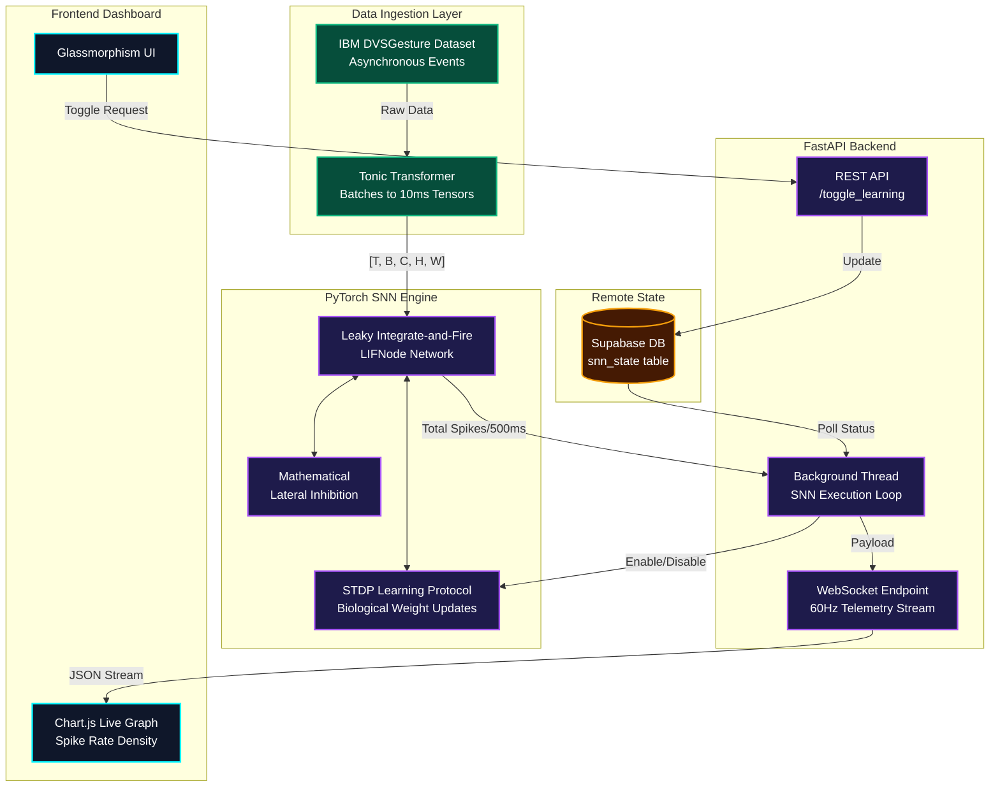

# 🧠 Software-Simulated Neuromorphic SNN Architecture

This document outlines the architecture, data flow, and technology stack of our real-time Spiking Neural Network (SNN) pipeline. It bridges the gap between biological plausibility and modern hardware-accelerated deep learning.

---

## 🏗️ System Architecture Diagram

---

## ⚙️ Component Breakdown

### 1. Data Ingestion (`ingestion.py`)
*   **Technology:** `tonic`, `torch.utils.data.DataLoader`
*   **Role:** Replaces standard video ingestion. It streams the IBM DVSGesture dataset, which consists of event-based neuromorphic camera recordings (changes in brightness recorded at the microsecond level).
*   **Processing:** Converts the sparse, asynchronous events into dense temporal tensors `[Time, Batch, Channels, Height, Width]` chopped into 500ms sliding windows for the PyTorch network.

### 2. SNN Core Engine (`snn_core.py`)
*   **Technology:** `PyTorch` (CUDA-enabled), `SpikingJelly`
*   **Role:** The "Brain". A shallow, step-mode Spiking Neural Network utilizing `LIFNode` (Leaky Integrate-and-Fire) neurons. 
*   **Feature:** Implements mathematical **Lateral Inhibition**. When a neuron fires, it applies an explicit negative voltage bias to neighboring neurons, preventing chaotic "winner-take-all" firing collapse.

### 3. Biological Learning (`stdp_learning.py`)
*   **Technology:** `spikingjelly.activation_based.learning.STDPLearner`
*   **Role:** Implements unsupervised **Spike-Timing-Dependent Plasticity**. 
*   **Execution:** Instead of backpropagation (which relies on standard math derivatives), STDP adjusts synapse weights biologically based on the precise temporal differences between pre-synaptic and post-synaptic spikes.

### 4. Server & Telemetry (`server.py`)
*   **Technology:** `FastAPI`, `WebSockets`, `Python Threading`
*   **Role:** The orchestration layer. The PyTorch SNN runs infinitely inside a daemon background thread. 
*   **Decoupling:** As the network computes, it drops its output (total spikes) into a shared dictionary. The WebSocket endpoint reads this dictionary and streams the spike density to the frontend at a buttery smooth **60 frames per second**.

### 5. Remote State Mutation (Supabase)
*   **Technology:** `supabase-py`
*   **Role:** Allows remote administrative control. The backend polls the Supabase `snn_state` table for the `learning_active` flag. This allows us to inject the STDP protocol dynamically into the running PyTorch simulation remotely without restarting the server.

### 6. Frontend UI (`index.html`)
*   **Technology:** Vanilla JS, HTML5, `Chart.js`
*   **Role:** A highly responsive, neon-aesthetic dashboard that ingests the 60Hz WebSocket stream and visualizes the network's internal spike rate density, proving that the lateral inhibition actively stabilizes the neural firing pattern.
